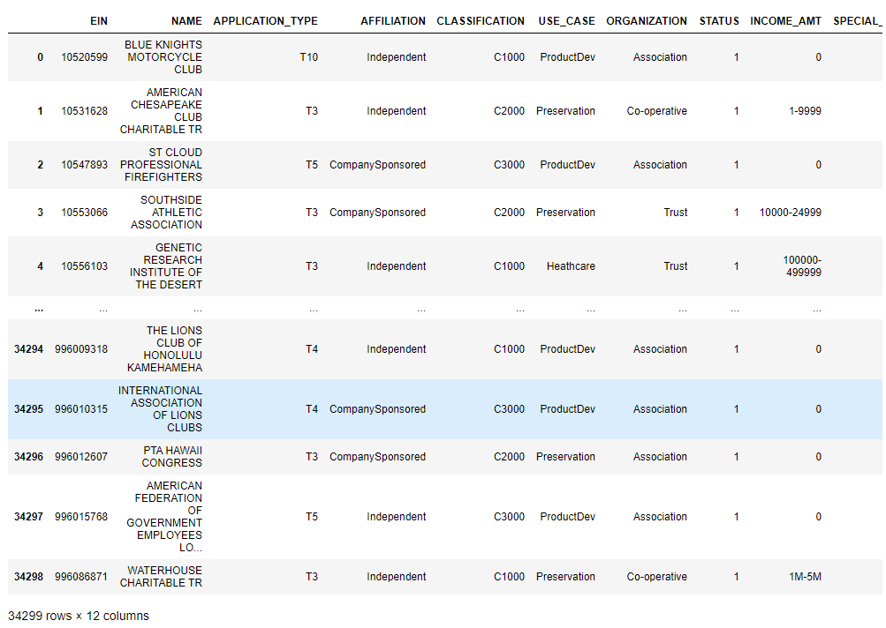

# Neural_Network_Charity_Analysis

## Overview of the Analysis
The purpose of this analysis is to utilize a dataset containing 34,000 organizations that have received funding form Alphabet Soup over the years.  From the metadata in this dataset, a binary classifier that is capable of predicting whether applicants will be successful if funded by Alphabet Soup is required.

The data will be analyzed through a deep neural learning process using Python libraries, Pandas, Scikit-Learn and TensorFlow.  This neural network model of course cannot be established prior to processing of the dataset to remove unhelpful column data, establish which columns might benefit from binning (e.g. taking minimally frequent unique values and referring them to an "other" group bin, convert categorical data to encoded numeric formats using the Scikit-Learn OneHotEncoder, and then creating a new data frame structure by merging categorical data back into the original dataframe and dropping the unneeded unencoded categorical columns.

The dataset is then split into features and target arrays and into training and testing datasets.  Last, the data is then fit and scaled or standardized using Scikit-Learn's StandardScaler class to scale the data.

Using TensorFlow Keras, the neural network is created by creating hidden layers and output layer with an appropriate, classification activation function.  The model is compiled and trained.  Leveraging callback, the weights are saved every 5th epoch and then the model is saved to an HDF5 file.

## Results:

### Data Preprocessing

#### What variable(s) are considered the target(s) for the model?
The target for the model is the column, "IS_SUCCESSFUL".  This is the ultimate output of the model to predict, will a company be successful if funded.

#### What variable(s) are considered to be the features for the model?
The features of the model include the relevant categories of data that help the model predict a correct classification of Is_Successful.  These include the following columns:

* APPLICATION_TYPE—Alphabet Soup application type
* AFFILIATION—Affiliated sector of industry
* CLASSIFICATION—Government organization classification
* USE_CASE—Use case for funding
* ORGANIZATION—Organization type
* STATUS—Active status
* INCOME_AMT—Income classification
* SPECIAL_CONSIDERATIONS—Special consideration for application
* ASK_AMT—Funding amount requested

#### What variable(s) are neither targets nor features, and should be removed from the input data?

From the data, the following columns were not deemed useful and were removed:

* EIN and NAME—Identification columns

### Compiling, Training, and Evaluating the Model
#### How many neurons, layers, and activation functions did you select for your neural network model, and why?
There were 3 layers selected in the original model.  Two hidden and one output layer.  Hidden layer 1 included 24 neurons and layer 2 included 22 neurons.  The Relu activation functions were selected for the hidden layers and the Sigmoid activation function for the output layer.  Sigmoid is appropriate for classification models.

#### Were you able to achieve the target model performance?
The desired model performance of greater than 75% accuracy was not achieved with the original configuration.  The outcome was an accurracy of 72.5%.

#### What steps did you take to try and increase model performance?

There were 3 attempts to increase the model's performance. 
##### First Attempt
* increasing the # of bins for App_Type by pushing all app types less than 150 (was 500) to "other".
* increasing the # of bins for Class by pushing all Class items to less than 1000 (was 1800) to "other".

Accuracy decreased to 72.54%

##### Second Attempt
* changing the # of bins for App_Type back to 500.
* changing the # of bins for Class back to 1800.

* changing the hidden layer nodes, decreasing each layer by 50%.  Layer 1 from 24 to 12.  Layer 2 from 22 to 11.

Accuracy decreased to 72.52

##### Third Attempt
* increasing hidden layer nodes back from original (24,22) to (36, 33).

Accurracy increased to 72.61%

## Summary
The trouble-shooting of a machine learning or deep neural model to reach accuracy thresholds desired is an iterative process.  This process could continue with reviewing the columns and adjusting possibly down.  Perhaps by removing the Status column to see if it might be limiting accuracy.

Another option might be to use different activation functions for the hidden layers or the output layers.  It would be interesting to see what the Tanh activation fuction produced for the output layer. 